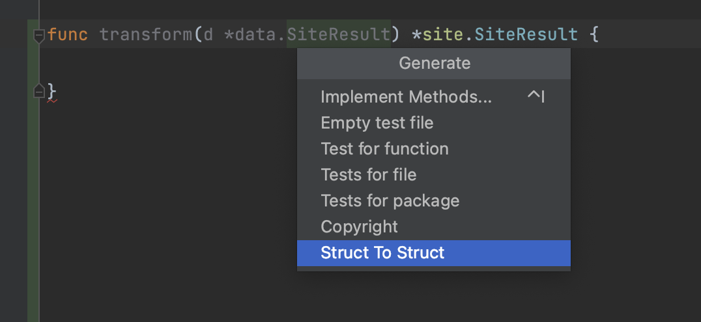

# go-struct-to-struct

IntelliJ plugin that Automatically generate two struct transformations through function declarations

### Usage

- define func

```
func transform(d *data.SiteResult) *site.SiteResult {

}

or 

func (s *SiteInfo) transform() *SiteResult {

}
```

- Use right click -> Generate (or shortcut key 【Command + N】 for Mac)



- then. gen code

```
func transform(d *data.SiteResult) *site.SiteResult {
	return &site.SiteResult{
		SiteAddr:         d.SiteAddr,
		TaskId:           d.TaskId,
		Url:              d.Url,
		Status:           d.Status,
		ResourceType:     d.ResourceType,
		Method:           d.Method,
		RequestBody:      d.RequestBody,
		RequestHeader:    d.RequestHeader,
		ResponseBody:     d.ResponseBody,
		ResponseHeader:   d.ResponseHeader,
		TenantId:         d.TenantId,
		IsTargetDocument: d.IsTargetDocument,
		FailedReason:     d.FailedReason,
		ParentUrl:        d.ParentUrl,
		ParentScreenshot: d.ParentScreenshot,
		DataSource:       d.DataSource,
		Tags:             d.Tags,
	}
}
```

### build

```
gradle build
```


### Reference


https://stackoverflow.com/questions/28294413/how-to-programmatically-use-intellij-idea-code-formatter

https://stackoverflow.com/questions/76561470/how-to-get-gostructtype-object-by-gofunctiondeclaration-idea-plugin-for-goland/76574114#76574114
